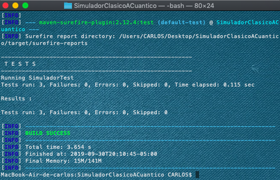
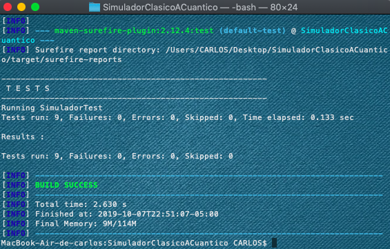

Realizado por **Carlos Andrés Castañeda Lozano**

# Programa simulación de lo clásico a lo cuántico

En este programa resolvere los retos de programación del libro **Quantum-Computing for Computer Scientists** los cuales corresponden al **Capitulo 3**.

## Programming drill 3.1.1

Este programa replica el sistema de **Las canicas**, el cual consiste en dada cierta cantidad de canicas en un orden ya establecido, reorganizarlas mediante una matriz booleana y un vector con el numero de canicas en cada posición, ademas tendremos un numero de **clicks** el cual nos determinará el numero de movimientos del sistema.

* Para que el usuario pueda disponer de este programa, tiene que ingresar una **matriz booleana** , un **vector con la cantidad de canicas** y el numero de **clicks** que el usuario desea.
 
## Programming drill 3.2.1

Este programa al igual que el anterior replica el sistema de **Las canicas**, pero a diferencia del anterior, cambia la matriz booleana por una **matriz de fraccionarios**.

* Para que el usuario pueda disponer de este programa, tiene que ingresar una **matriz de fraccionarios** , un **vector con la cantidad de canicas** y el numero de **clicks** que el usuario desea.

## Programming drill 3.2.2

Este programa replica el sistema de **La doble rendija**, el cual consiste en calcular la matriz de probabilidades del experimento segun la **cantidad de rendijas** y el **numero de objetivos** igresados por el usuario. 

## Programming drill 3.3.1

Este programa al igual que el programa **3.1.1** y **3.2.1** replica el sistema de **Las canicas**, pero a diferencia de los dos anteriores, se cambia la matriz por una **matriz y vector complejo**.

* Para que el usuario pueda disponer de este programa, tiene que ingresar una **matriz complaja** , un **vector complejo** y el numero de **clicks** que el usuario desea.

## Programming drill 3.3.2

Este programa al igual que el programa **3.2.2**  hace el experimento de la **doble rendija**, pero adiferncia del anterior, este incluye **numeros complejos**.

* El usuario debe de ingresar la **cantidad de rendijas** y el **numero de objetivos**.

# Pruebas unitarias

* Se crearon 4 pruebas unitarias, una por cada programa realizado. Estas pruebas se encuentran en **SimuladorTest**.
* **Ejemplo**:
```
@Test
    public void  programmingDrill311Test(){
        Simulador simulator = new Simulador();
        double[][] matrizBool = {{0,0,0,0},
                                 {0,0,0,1},
                                 {0,1,0,0},
                                 {1,0,0,0}};
        double[] estadoInicial = {6,2,5,3};
        double[] solucion = simulator.programmingDrill311Y321(matrizBool, estadoInicial, 2);
        double[] respuesta = {0,6,3,0};
        for(int i=0;i<respuesta.length;i++){
            assertTrue(respuesta[i]==solucion[i]);
        }
    }
```
* Para cada una de las pruebas se implementó JUnit y Maven.
* Se creó un metodo "**equals**" y **hashCode** la cual verifica si los resultados de las pruebas corresponden al resultado esperado.

## Ejecución de las pruebas

**Compiling**
```
$ mvn clean compile
```
**Packing**
```
$ mvn package
```
**Running the tests**
```
$ mvn test
```
## Captura


# Sistema cuántico de partícula en una línea

En este programa simularemos el primer sistema cuántico descrito en la **sección 4.1**.

## Probabilidad

Este programa calcula la probabilidad de encontrar una particula en una posición.

## Transición

Este programa al recibir dos vectores y calcular la probabilidad de transitar de el uno al otro después de hacer la observación

## Valor de la media y la varianza del observable

Este programa calcula la media y la varianza del observable en el estado dado.

## Dinámica

Este programa calcula el estado final a partir de un estado inicial.

# Pruebas unitarias

* Se crearon 5 pruebas unitarias, una por cada programa realizado. Estas pruebas se encuentran en **SimuladorTest**.
* **Ejemplo**:

```
 @Test
    public void probabilidadTest() {
        VectorComplejo state = new VectorComplejo(new Complejo[4]);
        state.getVector()[0] = new Complejo(-3,-1);
        state.getVector()[1] = new Complejo(0,-2);
        state.getVector()[2] = new Complejo(0,1);
        state.getVector()[3] = new Complejo(2,0);
        int position = 2;
        Double expected = 0.052624;
        Double actual = Simulador.probabilidad(state, position);
        assertEquals(expected, actual, 0.0001);
    }
```
* Para cada una de las pruebas se implementó JUnit y Maven.
* Se creó un metodo "**equals**" y **hashCode** la cual verifica si los resultados de las pruebas corresponden al resultado esperado.

## Ejecución de las pruebas

**Compiling**
```
$ mvn clean compile
```
**Packing**
```
$ mvn package
```
**Running the tests**
```
$ mvn test
```
## Captura


# Experimento Doble rendija

El experimento de la doble rendija es uno de los grandes misterios de la física cuántica. Consiste, con un láser pasar dos rendijas con un haz de luz. Normalmente, se pensaría que el resultado es en realidad solo dos rendijas, pero forma un montón de rendijas. un comportamiento muy extraño para nosotros, pero básico para el mundo cuántico.

## Desarrollo

* Para este experimento vamos a coger un **laser de 5mW, un alambre de soldadura y cinta negra**.
* Para que el experimento funcione correctamente debemos de pegar en la mitad del laser el **alambre de soldadura** con ayuda de la **cinta negra**.
* luego tapamos con **cinta negra** las dos mitades del haz lacer, solo dejando dos finas ranuras, una a cada extremo del **alambre**.
* Y por ultimo una base para sostener nuestro **laser**.

## Capturas


# License
This project is under the Apache license - see [LICENSE](LICENSE.txt) for more details.
